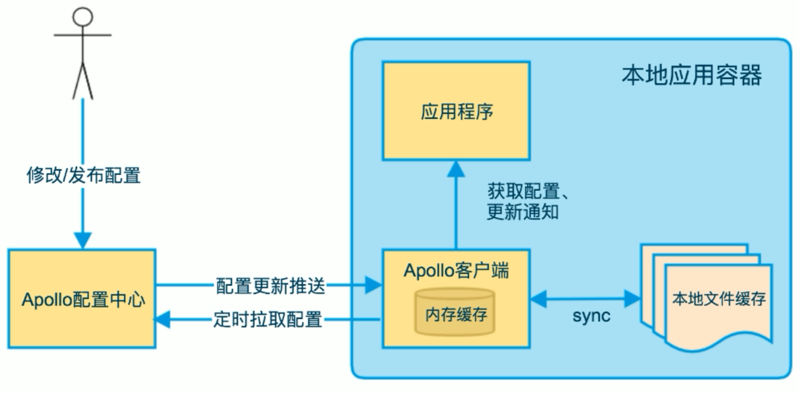
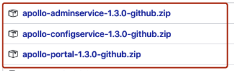

# Apollo
Apollo（阿波罗）是携程框架部门研发的分布式配置中心，能够集中化管理应用的不同环境、不同集群的配置，配置修改后能够实时推送到应用端，并且具备规范的权限、流程治理等特性，适用于微服务配置管理场景。

Apollo包括服务端和客户端两部分：

服务端基于Spring Boot和Spring Cloud开发，打包后可以直接运行，不需要额外安装Tomcat等应用容器。

Java客户端不依赖任何框架，能够运行于所有Java运行时环境，同时对Spring/Spring Boot环境也有较好的支持。

## Apollo特性
1. 统一管理不同环境、不同集群的配置
2. 配置修改实时生效（热发布）
3. 版本发布管理
4. 灰度发布
5. 权限管理、发布审核、操作审计
6. 客户端配置信息监控
7. 提供开放平台API

## 执行流程
1. 在Apollo配置中心修改配置
2. 应用程序通过Apollo客户端从配置中心拉取配置信息；用户通过Apollo配置中心修改或发布配置后，会有两种机制来保证应用程序来获取最新配置：
    * 一种是Apollo配置中心会向客户端**推送**最新的配置；
    * 另外一种是Apollo客户端会**定时**从Apollo配置中心**拉取**最新的配置。

## 安装Apollo
### 环境
* Java 1.8
* MySQL 5.6.5+ 
    > Apollo的表结构对timestamp使用了多个default声明，所以需要5.6.5以上版本。
    
### 下载配置
https://github.com/ctripcorp/apollo/tags

解压安装包后将apollo-configservice-1.3.0.jar, apollo-adminservice-1.3.0.jar, apollo-portal-1.3.0.jar放置于apollo目录下

### 创建数据库
Apollo服务端共需要两个数据库
* ApolloPortalDB：ApolloPortalDB只需要在生产环境部署一个即可
    > 下载地址：https://github.com/ctripcorp/apollo/blob/v1.3.0/scripts/db/migration/portaldb/V1.0.0__initialization.sql
* ApolloConfigDB：ApolloConfigDB需要在每个环境部署一套
    > 下载地址：https://github.com/ctripcorp/apollo/blob/v1.3.0/scripts/db/migration/configdb/V1.0.0__initialization.sql

### 启动Apollo
Apollo默认会启动3个服务，分别使用8070, 8080, 8090端口，请确保这3个端口当前没有被使用
1. 启动apollo-configservice，在apollo目录下执行如下命令
    > java -Xms256m -Xmx256m -Dspring.datasource.url=jdbc:mysql://localhost:3306/apolloconfigdb?characterEncoding=utf8 -Dspring.datasource.username=root -Dspring.datasource.password=root -jar apollo-configservice-1.3.0.jar  
    >  
    > 可通过-Dserver.port=8080修改默认端口
2. 启动apollo-adminservice
    > java -Xms256m -Xmx256m -Dspring.datasource.url=jdbc:mysql://localhost:3306/apolloconfigdb?characterEncoding=utf8 -Dspring.datasource.username=root -Dspring.datasource.password=root -jar apollo-adminservice-1.3.0.jar  
    >  
    > 可通过-Dserver.port=8090修改默认端口
3. 启动apollo-portal
    > java -Xms256m -Xmx256m -Ddev_meta=http://localhost:8080/ -Dserver.port=8070 -Dspring.datasource.url=jdbc:mysql://localhost:3306/apolloportaldb?characterEncoding=utf8 -Dspring.datasource.username=root -Dspring.datasource.password=root -jar apollo-portal-1.3.0.jar  
    >  
    > 可通过-Dserver.port=8070修改默认端口

启动成功后，访问管理页面，地址：localhost:8070， 账密：apollo/admin

## 

