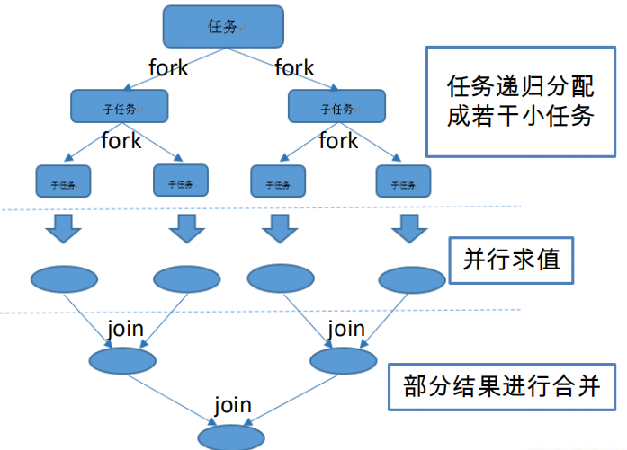
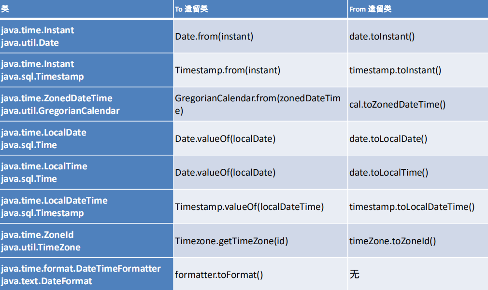

# Java8
## Java8 新特性
* 速度更快
    > HashMap数据结构的优化（数组+链表+红黑树）。<br>
    > 底层内存结构：去掉永久区，加入MetaSpace元空间，使用物理内存（更快）。（PremGenSize和MaxPremGenSize被MetaSpaceSize和MaxMetaSpaceSize所取代）
* 代码更少（增加了新的语法 Lambda 表达式）
* 强大的 Stream API
* 便于并行
* 最大化减少空指针异常 Optional

## Lambda表达式
> Lambda 是一个匿名函数，可以把 Lambda 表达式理解为是一段可以传递的代码（将代码像数据一样进行传递）。

基础语法:
* 操作符 "->"
    * 左侧：Lambda 表达式的参数列表
    * 右侧：Lambda 表达式中所需执行的功能， 即 Lambda 体
* 语法格式1：无参数，无返回值。
    ```
    () -> System.out.println("Hello Lambda!");
    ```
* 语法格式2：有一个参数，并且无返回值。
    ```
    (x) -> System.out.println(x)
    ```
* 语法格式3：若只有一个参数，小括号可以省略不写。
    ```
    x -> System.out.println(x)
    ```
* 语法格式4：有两个以上的参数，有返回值，并且 Lambda 体中有多条语句。
    ```
    Comparator<Integer> com = (x, y) -> {
        System.out.println("函数式接口");
        return Integer.compare(x, y);
    };
    ```
* 语法格式5：若 Lambda 体中只有一条语句， return 和 大括号都可以省略不写。
    ```
    Comparator<Integer> com = (x, y) -> Integer.compare(x, y);
    ```
* 语法格式6：Lambda 表达式的参数列表的数据类型可以省略不写，因为JVM编译器通过上下文推断出数据类型，即“**类型推断**”。
    ```
    (Integer x, Integer y) -> Integer.compare(x, y);
    ```

## 函数式接口
Lambda 表达式需要“函数式接口”的支持
* 接口中只有一个抽象方法的接口，称为函数式接口。
* 可以使用注解 `@FunctionalInterface` 修饰（可以检查是否是函数式接口）。

Java8 内置的四大核心函数式接口
* 消费型接口
    ```
    Consumer<T>
        void accept(T t);
    ```
* 供给型接口
    ```
    Supplier<T>
        T get();
    ```
* 函数式接口
    ```
    Function<T, R>
        R apply(T t);
    ```
* 断言型接口
    ```
    Predicate<T>
        boolean test(T t);        
    ```

其他内置接口：

函数式接口  | 参数类型  | 返回类型  | 用途
------------- | ------------- | ------------- | -------------
**`BiFunction<T, U, R>`**  | T, U  | R  | 对类型为 T, U 参数应用操作，返回 R 类型的结果。包含方法为R apply(T t, U u);
**`UnaryOperator<T>(Function子接口)`**  | T  | T  | 对类型为T的对象进行一元运算，并返回T类型的结果。包含方法为T apply(T t);
**`BinaryOperator<T>(BiFunction 子接口)`**  | T, T  | T  | 对类型为T的对象进行二元运算，并返回T类型的结果。包含方法为T apply(T t1, T t2);
**`BiConsumer<T, U>`**  | T, U  | void  | 对类型为T, U 参数应用操作。包含方法为void accept(T t, U u)
**`ToIntFunction<T>`**  | T  | int  | 计算 int 值的函数
**`ToLongFunction<T>`**  | T  | long  |计算 long 值的函数
**`ToDoubleFunction<T>`**  | T  | double  |计算 double 值的函数
**`IntFunction<R>`**  | int  | R  | 参数为 int 类型的函数
**`LongFunction<R>`**  | long  | R  | 参数为 long 类型的函数
**`DoubleFunction<R>`**  | double  | R  | 参数为 double 类型的函数


## 方法引用与构造器引用
### 方法引用
若 Lambda 体中的功能，已经有方法提供了实现，可以使用方法引用
* 语法格式1： 对象的引用 :: 实例方法名
* 语法格式2： 类名 :: 静态方法名
* 语法格式3： 类名 :: 实例方法名

注意：
* 方法引用所引用的方法的参数列表与返回值类型，需要与函数式接口中抽象方法的参数列表和返回值类型保持一致！
* 若Lambda 的参数列表的第一个参数，是实例方法的调用者，第二个参数(或无参)是实例方法的参数时，格式： ClassName::MethodName


### 构造器引用
构造器的参数列表，需要与函数式接口中参数列表保持一致！
* 类名 :: new

### 数组引用
* 类型[] :: new

## Stream API
Stream API 的操作步骤：
* 创建 Stream

* 中间操作
    > 多个中间操作可以连接起来形成一个流水线，除非流水线上触发终止操作，<br>
    > 否则中间操作不会执行任何的处理！而在终止操作时一次性全部处理，称为“惰性求值”。
    
    **筛选与切片**
    
    方法 | 描述
    ------------- | -------------
    **`filter(Predicate p)`**  | 接收 Lambda ， 从流中排除某些元素。
    **`distinct()`**  | 筛选，通过流所生成元素的 hashCode() 和 equals() 去除重复元素。
    **`limit(long maxSize)`**  | 截断流，使其元素不超过给定数量。
    **`skip(long n)`**  | 跳过元素，返回一个去掉了前 n 个元素的流。若元素不足，则返回空流。与 limit(n) 互补。
    
    **映射**
    
    方法 | 描述
    ------------- | -------------
    **`map(Function f)`**  | 接收一个函数作为参数，该函数会被应用到每个元素上，并将其映射成一个新的元素。
    **`mapToDouble(ToDoubleFunction f)`**  | 接收一个函数作为参数，该函数会被应用到每个元素上，产生一个新的 DoubleStream。
    **`mapToInt(ToIntFunction f)`**  | 接收一个函数作为参数，该函数会被应用到每个元素上，产生一个新的 IntStream。
    **`mapToLong(ToLongFunction f)`**  | 接收一个函数作为参数，该函数会被应用到每个元素上，产生一个新的 LongStream。
    **`flatMap(Function f)`**  | 接收一个函数作为参数，将流中的每个值都换成另一个流，然后把所有流连接成一个流。
    
    **排序**
    
    方法 | 描述
    ------------- | -------------
    **`sorted()`**  | 产生一个新流，其中按自然顺序排序。
    **`sorted(Comparator comp)`**  | 产生一个新流，其中按比较器顺序排序。
    
* 终止操作(终端操作)
    > 终端操作会从流的流水线生成结果。
    > 其结果可以是任何不是流的值，例如：List、Integer，甚至是 void 。
    
    **查找与匹配**
    
    方法 | 描述
    ------------- | -------------
    **`allMatch(Predicate p)`**  | 检查是否匹配所有元素。
    **`anyMatch(Predicate p)`**  | 检查是否至少匹配一个元素。
    **`noneMatch(Predicate p)`**  | 检查是否没有匹配所有元素。
    **`findFirst()`**  | 返回第一个元素。
    **`findAny()`**  | 返回当前流中的任意元素。
    **`count()`**  | 返回流中元素总数。
    **`max(Comparator c)`**  | 返回流中最大值。
    **`min(Comparator c)`**  | 返回流中最小值。
    **`forEach(Consumer c)`**  | 内部迭代。
    
    **归约**
    
    方法 | 描述
    ------------- | -------------
    **`reduce(T iden, BinaryOperator b)`**  | 可以将流中元素反复结合起来，得到一个值；返回 T。
    **`reduce(BinaryOperator b)`**  | 可以将流中元素反复结合起来，得到一个值；返回 Optional<T>。
    
    **收集**
    
    方法 | 描述
    ------------- | -------------
    **`collect(Collector c)`**  | 将流转换为其他形式。接收一个 Collector接口的实现，用于给Stream中元素做汇总的方法。

### 并行流
* 把一个内容分成多个数据块，并用不同的线程分别处理每个数据块的流。
* Java 8 对并行进行了优化，Stream API 可以通过 parallel() 与 sequential() 对并行流与顺序流进行切换。
* 底层fork/join框架：拆分(fork) + join(汇总)
* fork/join 框架与传统线程池的区别
    > 采用“工作窃取”模式（work-stealing）<br>
    > 如果某个子问题由于等待另外一个子问题的完成而无法继续运行，那么处理该子问题的线程会主动寻找其他尚未运行的子问题来执行。
    > 这种方式减少了线程的等待时间，提高了性能。



## 新时间日期 API
* LocalDate、LocalTime、LocalDateTime 类的实例是**不可变的对象**。（线程安全）
* Instant：时间戳。
* Duration：用于计算两个“时间”间隔。
* Period：用于计算两个“日期”间隔。
* TemporalAdjuster：时间校正器。有时我们可能需要获取例如：将日期调整到“下个周日”等操作。
* TemporalAdjusters：该类通过静态方法提供了大量的常用 TemporalAdjuster 的实现。
* DateTimeFormatter：解析与格式化。
* ZonedDate、ZonedTime、ZonedDateTime 时区的处理。



## 其他新特性
### Optional类
> Optional<T> 类(java.util.Optional) 是一个容器类，代表一个值存在或不存在，<br>
> 原来用 null 表示一个值不存在，现在 Optional 可以更好的表达这个概念。<br>
> 并且可以避免空指针异常。

常用方法：
* Optional.of(T t)：创建一个 Optional 实例
* Optional.empty()：创建一个空的 Optional 实例
* Optional.ofNullable(T t)：若 t 不为 null,创建 Optional 实例,否则创建空实例
* isPresent()：判断是否包含值
* orElse(T t)：如果调用对象包含值，返回该值，否则返回t
* orElseGet(Supplier s)：如果调用对象包含值，返回该值，否则返回 s 获取的值
* map(Function f)：如果有值对其处理，并返回处理后的Optional，否则返回 Optional.empty()
* flatMap(Function mapper)：与 map 类似，要求返回值必须是Optional

### 接口中的默认方法与静态方法
#### 接口中的默认方法
接口默认方法的”类优先”原则
```java
interface MyFunc {
    default String getName() {
        return "Hello Java8!";
    }
}

interface Named {
    default String getName() {
        return "Hello new features";
    }
}

class MyClass implements MyFunc, Named {
    public String getName() {
        return Named.super.getName();
    }
}
```

#### 接口中的静态方法
Java8 中，接口允许添加静态方法。
```java
interface Named {
    public Integer myFun();
    default String getName() {
        return "Hello Java8";
    }
    static void show() {
        System.out.println("Hello Lambda!");
    }
}
```
