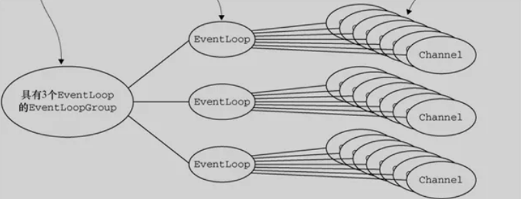

## 目录
* [Netty的特点与NIO](#Netty的特点与NIO)
* [Netty核心组件](#Netty核心组件)
    * [channel](#channel)
    * [EventLoop和EventLoopGroup](#EventLoop和EventLoopGroup)
    * [ChannelHandler、ChannelPipeline和ChannelHandlerContext](#ChannelHandler、ChannelPipeline和ChannelHandlerContext)
* [Netty的数据容器](#Netty的数据容器)
    * [ByteBuf工作原理](#ByteBuf工作原理)
    * [ByteBuf使用模式](#ByteBuf使用模式)
    * [ByteBuf的分配](#ByteBuf的分配)
* [Netty的Bootstrap](#Netty的Bootstrap)
* [小结](#小结)

* [Netty 通信中的粘包、拆包](#Netty通信中的粘包、拆包)
    * [什么是粘包和拆包](#什么是粘包和拆包)
    * [粘包、拆包发生的原因](#粘包、拆包发生的原因)
    * [粘包、拆包解决办法](#粘包、拆包解决办法)
    * [Netty的拆包解决方案](#Netty的拆包解决方案)

# Netty的特点与NIO
Netty是一个异步的、基于事件驱动的网络应用框架。
使用阻塞I/O处理多个连接：

为了解决阻塞等待，推出了NIO（Non-blocking I/O）。
其中，Selector 机制就是NIO的核心。
当每次客户端请求时，会创建一个SocketChannel，并将其注册到Selector上（多路复用器）。
然后，Selector监听服务端IO读写事件，此时客户端并不用等待IO事件完成，可以继续做接下来的工作。
一旦服务端完成了IO读写操作，Selector会接到通知，同时告诉客户端IO操作已经完成。
接到通知的客户端，就可以通过SocketChannel获取需要的数据了。

对于开发者来说，Netty具有以下特点：
- 对NIO进行封装，开发者不需要关注NIO的底层原理，只需要调用Netty组件就能够完成工作。
- 对网络调用透明，从Socket建立TCP连接到网络异常的处理都做了包装。
- 对数据处理灵活，Netty支持多种序列化框架，通过“ChannelHandler”机制，可以自定义“编/解码器”。
- 对性能调优友好，Netty提供了线程池模式以及Buffer的重用机制（对象池化），不需要构建复杂的多线程模型和操作队列。

# Netty核心组件
## channel
当客户端和服务端连接的时候会建立一个Channel。
Channel我们可以理解为Socket连接，它负责基本的IO操作，例如：bind()，connect()，read()，write()等等。
Channel就是代表连接，实体之间的连接，程序之间的连接，文件之间的连接，设备之间的连接。
同时它也是数据入站和出站的载体。

## EventLoop和EventLoopGroup
如果服务发出的消息称作“出站”消息，服务接受的消息称作“入站”消息。那么消息的“出站”/“入站”就会产生事件（Event）。
监控和协调事件的机制（组件）就是EventLoop，一个EventLoop可以服务于多个Channel。
每个EventLoop会占用一个Thread，Thread会处理EventLoop上面发生的所有 IO 操作和事件（Netty 4.0）。

EventLoopGroup是用来生成EventLoop的，一个EventLoopGroup包含了多个EventLoop对象。
EventLoopGroup要做的就是创建一个新的Channel，并且给它分配一个EventLoop。

在异步传输的情况下，一个EventLoop可以处理多个Channel产生的事件，它主要的工作就是事件的发现和通知。
- 当客户端发送消息到服务器时，EventLoop发现以后会通知服务器去获取消息，同时客户端可以进行其他工作。
- 当EventLoop检测到服务端返回的消息时，会通知客户端去获取消息。

整个过程，EventLoop就是监视器+传声筒。

## ChannelHandler、ChannelPipeline和ChannelHandlerContext
ChannelHandler：事件的处理者。
在ChannelHandler中可以添加一些业务代码，例如数据转换，逻辑运算等等。

并且，针对出站和入站的事件，有不同的ChannelHandler，分别是：
- ChannelInBoundHandler（入站事件处理器）
- ChannelOutBoundHandler（出站事件处理器）

ChannelPipeline：决定ChannelHandler处理事件的顺序。

简而言之，ChannelPipeline就是负责给事件(处理器)排队；也可以添加或者删除ChannelHandler，管理整个队列。

ChannelHandlerContext：管理ChannelHandler和ChannelPipeline的交互，
当有ChannelHandler添加到ChannelPipeline时，同时会创建ChannelHandlerContext。

ChannelHandlerContext参数贯穿ChannelPipeline，将信息传递给每个ChannelHandler，是个“通讯员”。

Netty核心组件关系图：

# Netty的数据容器
Netty将ByteBuf作为数据容器，来存放数据。

## ByteBuf工作原理
从结构上来说，ByteBuf由一串字节数组构成。数组中每个字节用来存放信息。

ByteBuf提供了两个索引，一个用于读取数据，一个用于写入数据。
这两个索引通过在字节数组中移动，来定位需要读或者写信息的位置。

读取时，ByteBuf的readerIndex（读索引）会根据读取的字节数递增。
写入时，ByteBuf的writerIndex（写索引）会根据写入的字节数递增。

极限情况：readerIndex刚好读到了writerIndex写入的地方，超过时，抛IndexOutOfBoundsException异常。

## ByteBuf使用模式
根据存放缓冲区的不同分为三类：
- 堆缓冲区：数据存储在JVM的堆中，数组实现，快速分配；可被堆快速释放，通过ByteBuf.array()来获取byte[]数据。
- 直接缓冲区：JVM的堆之外直接分配内存。
- 复合缓冲区：堆缓冲和直接缓冲结合，Netty提供CompositeByteBuf。

## ByteBuf的分配
Netty提供了两种ByteBufAllocator的实现：
- PooledByteBufAllocator：实现了ByteBuf对象的池化，提高性能减少内存碎片。
- UnpooledByteBufAllocator：没有对象的池化，每次会生成新的对象实例。

对象池化的技术和线程池相似，目的是提高内存使用率。
实现思路：在JVM堆内存上构建一层内存池，通过allocate方法获取内存池中的空间，通过release方法将空间归还给内存池。

对象的生成和销毁，会大量地调用allocate和release方法，因此内存池面临碎片空间回收的问题，
在频繁申请和释放空间后，内存池需要保证连续的内存空间，用于对象的分配。

基于这个需求，有两种算法用于优化这一块的内存分配：伙伴系统和 slab 系统。
- 伙伴系统：完全二叉树，左右节点互为伙伴，每个节点代表一个内存块。内存分配将大块内存不断二分，直到找到满足所需的最小内存分片。
- slab系统：解决内存碎片问题，将大块内存按照一定内存大小进行等分，形成相等大小的内存片的内存集。（申请尽量小块内存或者其整数倍的内存）

Netty内存池管理以Allocate对象的形式出现。一个Allocate对象由多个Arena组成，每个Arena能执行内存块的分配和回收。
Arena内有三类内存块管理单元：
- TinySubPage
- SmallSubPage
- ChunkList

# Netty的Bootstrap
Bootstrap的作用就是将Netty核心组件配置到程序中，并且让它们运行起来。
- Bootstrap：客户端的引导。
- ServerBootstrap：服务端的引导。

客户端引导Bootstrap，主要有两个方法bind()和connect()。
Bootstrap通过bind()方法创建一个Channel。
在bind()之后，通过调用connect()方法来创建Channel连接。

服务端引导ServerBootstrap，在Bind()方法之后会创建一个ServerChannel，它不仅会创建新的Channel还会管理已经存在的Channel。

服务端引导和客户端引导的区别：
- 服务端引导绑定一个端口，用来监听客户端的连接请求。而客户端引导只要知道服务端IP和Port建立连接就可以了。
- 客户端引导需要一个EventLoopGroup；服务端引导则需要两个EventLoopGroup（服务器需要两组不同的Channel，第一组ServerChannel自身监听本地端口的套接字，第二组用来监听客户端请求的套接字）。

# 小结
Selector：多路复用器（核心）
Channel：提供Socket连接通道。
EventLoop：监听Channel产生的事件，通知执行者。（相当于线程）
EventLoopGroup：生成和管理EventLoop（相当于线程池）
ChannelHandler：事件处理器（编写业务代码）
ChannelPipeline：给事件处理器(ChannelHandler)排队。（理解为队列）
ChannelHandlerContext：负责传递信息。
ByteBuf：Netty的数据容器。（字节数组）
Bootstrap：启动器。

# Netty通信中的粘包、拆包
如果客户端连续不断的向服务器端发送数据包时，服务器端接收的数据会出现两个数据包粘在一起的情况，
这就是TCP协议中经常会遇到粘包和拆包问题。

## 什么是粘包和拆包
假设客户端向服务器端连续发送了两个数据包，用packet1和packet2来表示，
那么服务器端收到的数据可以分为三种，如下：

- 接收端正常收到两个数据包

- 接收端只收到一个数据包，由于TCP不会丢包，所以一个数据包中包含了发送端发送的两个数据包信息；
接收端不知道这两个数据包的界限，所以接收端很难处理。（粘包）

- 接收端收到了两个数据包，但是这两个数据包要么是不完整的，要么就是多出来一块。（拆包和粘包）

TCP是个“流”协议，没有界限的一串数据。
TCP底层并不了解上层业务数据的具体含义，它会根据TCP缓冲区的实际情况进行包的划分，
所以在业务上认为，一个完整的包可能会被TCP拆分成多个包进行发送，也有可能把多个小的包封装成一个大的数据包发送，这就是所谓的TCP粘包和拆包问题。

## 粘包、拆包发生的原因
拆包：
- 要发送的数据大于TCP发送缓冲区的剩余空间的大小。
- 待发送数据大于MSS(最大报文长度)

粘包：
- 要发送的数据小于TCP发送缓冲区的大小。
- 接收数据端的应用层没有及时读取接收缓冲区中的数据。

## 粘包、拆包解决办法
由于底层的TCP无法理解上层的业务数据，所以在底层是无法保证数据包不被拆分和重组的；
这个问题只能通过上层的`应用协议栈`设计来解决，根据业界的主流协议的解决方案，归纳如下：
- 消息定长：发送端将每个数据包封装为固定长度（不够用0填充）。
- 设置消息边界：服务端从网络流中按`消息边界`分离出消息内容。在包尾增加回车换行符进行分割，例如FTP协议。

将消息分为消息头和消息体，消息头中包含表示消息总长度（或者消息体长度）的字段。

## Netty的拆包解决方案
Netty中的拆包器大致如下：
- `固定长度`的拆包器 FixedLengthFrameDecoder：每个应用层数据包的都拆分成都是固定长度的大小。
- `行`拆包器 LineBasedFrameDecoder：以换行符作为分隔符，进行分割拆分。
- `分隔符`拆包器 DelimiterBasedFrameDecoder：通过自定义的分隔符，进行分割拆分。
- `基于数据包长度`的拆包器 LengthFieldBasedFrameDecoder：按照应用层数据包的大小，拆包。这个拆包器，有一个要求，就是应用层协议中包含数据包的长度。

