软件设计师教程(第5版)笔记
=====
基于`《软件设计师教程》`（`第五版`，`褚华 霍秋艳`主编，清华大学出版社）。

## 目录
* [1. 计算机网络概论](#1-计算机网络概论)
    * [1-1. 计算机系统基础知识](#1-1-计算机系统基础知识)
        * [1-1-1. 计算机系统硬件基本组成](#1-1-1-计算机系统硬件基本组成)
        * [1-1-2. 中央处理单元](#1-1-2-中央处理单元)
            * [(1) cpu的功能](#(1)-cpu的功能)
            * [(2) CPU的组成](#(2)-cpu的组成)
            * [(3) 多核CPU](#(3)-多核cpu)
        * [1-1-3. 数据表示](#1-1-3-数据表示)
            * [(1) 原码表示法](#(1)-原码表示法)
            * [(2) 反码表示法](#(2)-反码表示法)
            * [(3) 补码表示法](#(3)-补码表示法)
            * [(4) 移码表示法](#(4)-移码表示法)
            * [(5) 定点数](#(5)-定点数)
            * [(6) 浮点数](#(6)-浮点数)
            * [(7) 工业标准IEEE754](#(7)-工业标准IEEE754)
        * [1-1-4. 校验码](#1-1-4-校验码)
            * [(1) 奇偶校验码](#(1)-奇偶校验码)
            * [(2) 海明码](#(2)-海明码)
            * [(3) 循环冗余校验码](#(3)-循环冗余校验码)
    * [1-2. 计算机体系结构](#1-2-计算机体系结构) 
        * [1-2-1. 计算机体系结构的发展](#1-2-1-计算机体系结构的发展)
        * [1-2-2. 存储系统](#1-2-2-存储系统)
            * [(1) 存储器的层次结构](#(1)-存储器的层次结构)
            * [(2) 存储器的分类](#(2)-存储器的分类)
            * [(3) 相联存储器](#(3)-相联存储器)
            * [(4) 高速缓存](#(4)-高速缓存)
            * [(5) 虚拟存储](#(5)-虚拟存储)
            * [(6) 外存储器](#(6)-外存储器)
            * [(7) 磁盘阵列技术](#(7)-磁盘阵列技术)
        * [1-2-3. 出入/输出技术](#1-2-3-出入/输出技术)
            * [(1) 直接程序控制](#(1)-直接程序控制)
            * [(2) 中断方式](#(2)-中断方式)
            * [(3) 直接存储器存取方式](#(3)-直接存储器存取方式)
            * [(4) 输入/输出处理机](#(4)-输入/输出处理机)
        * [1-2-4. 总线结构](#1-2-4-总线结构)
            * [(1) 总线的分类](#(1)-总线的分类)
    * [1-3. 安全性、可靠性与系统性能评测基础知识](#1-3-安全性、可靠性与系统性能评测基础知识) 
        * [1-3-1. 计算机安全概述](#1-3-1-计算机安全概述)
        * [1-3-2. 加密技术和认证技术](#1-3-2-加密技术和认证技术)
            * [(1) 加密技术](#(1)-加密技术)
            * [(2) 认证技术](#(2)-认证技术)
        

# 1 计算机网络概论

## 1-1 计算机系统基础知识

### 1-1-1 计算机系统硬件基本组成
- 计算机系统=硬件+软件
- 基本硬件系统：运算器、控制器、存储器、输入设备和输出设备。
- 中央处理单元（CPU）：运算器、控制器等部件集成到一起。CPU是硬件系统的核心，用于数据的加工处理，完成算术逻辑运算及控制功能。
- 存储器：记忆设备，分内部和外部存储器，前者速度高、容量小，临时；后者容量大、速度慢，可以长期保存程序和数据。
- 外部设备（外设）：输入设备+输出设备。

### 1-1-2 中央处理单元
#### (1) cpu的功能
- 程序控制：通过执行指令来控制程序。
- 操作控制：产生每条指令的操作信号，并将信号送往对应的部件，控制相应的部件。
- 时间控制：对指令执行过程钟操作信号的出现时间、持续时间及出现的时间顺序进行控制。
- 数据处理：对数据进行算术和逻辑等方式的运算（最根本任务）。
- 对系统内部和外部的中断（异常）做出相应。

#### (2) cpu的组成
主要由运算器、控制器、寄存器组和内部总线等部件组成。

运算器：
1. 算术逻辑单元（ALU）：对数据进行算术运算和逻辑运算。
2. 累加寄存器（AC）：是一个通用寄存器，为ALU提供一个工作区。
3. 数据缓冲寄存器（DR）：是CPU和内存、外部设备之间数据传送的中转站（缓冲）；在单累加器结构的运算器中，可兼作为操作数寄存器。
4. 状态条件寄存器（PSW）：PSW保存由算术和逻辑运算的结果建立的各种条件码内容；主要分状态标志、控制标志。

控制器：保证程序正确执行，处理异常事件。
1. 指令寄存器（IR）：CPU执行一条指令时，先把它从内存储器取到缓冲寄存器中，再送入IR暂存；
2. 程序计数器（PC）：具有寄存信息和计数两种功能，又称指令计数器。
3. 地址寄存器（AR）：保存当前CPU所访问的内存单元的地址。
4. 指令译码器（ID）：指令包含操作码和地址码；ID对指令的操作码进行解释。

总线：控制各种中断请求，按优先级高低对中断请求进行排队，逐个交给CPU处理。

寄存器组： 
专用寄存器、通用寄存器。运算器和控制器中的寄存器是专用寄存器；通用寄存器用途广泛可由程序员规定其用途。

#### (3) 多核CPU
多任务处理。

### 1-1-3 数据表示
#### (1) 原码表示法
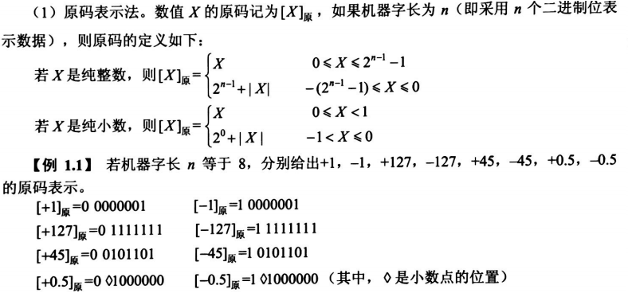

在原码表示法中，最高位是符号为，0表示正号，1表示负号，其余n-1位表示数值的绝对值。数值0的原码有两种形式：[+0]原=0 0000000，[-0]原=1 0000000。

#### (2) 反码表示法
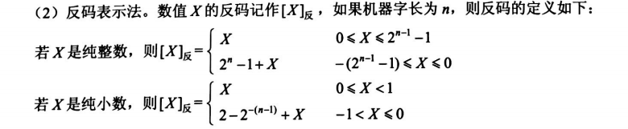
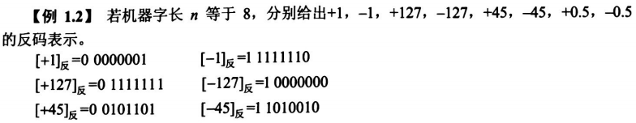

在反码表示中，最高位是符号位，0表示正号，1表示负号，正数的反码与原码相同，负数的反码则是其绝对值按位求反。数值0的反码表示有两种形式：[+0]反=0 0000000，[-0]反=1 1111111。

#### (3) 补码表示法
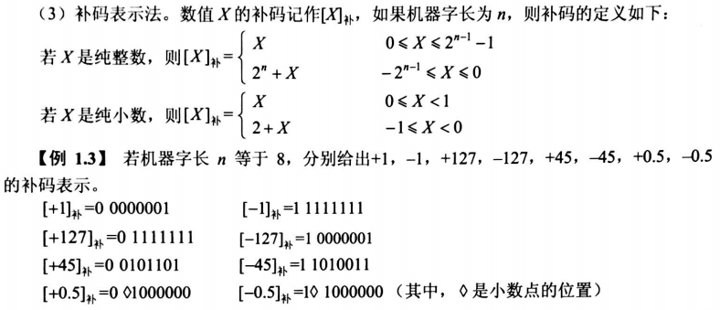

在补码表示法中，最高位为符号位，0表示正号，1表示负号，正数的补码与其原码和反码相同，负数的补码则等于反码的末尾加1。数值0的补码只有唯一一种形式：[+0]补=0 0000000，[-0]补=0 0000000。

#### (4) 移码表示法
浮点数的表示格式

实际上，在偏移2n-1的情况下，只要将`补码`的符号位取反便可获得相应的移码的表示。

#### (5) 定点数
定点数：小数点的位置固定不点的数。
- 定点整数：纯整数，小数点在最低有效数值位之后。
- 定点小数：纯小数，小数点在最高有效数值位之前。

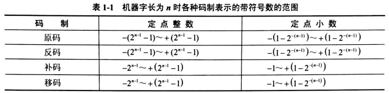

#### (6) 浮点数
浮点数：小数点不固定的数。
在浮点数表示法中，阶码为带符号的纯整数，尾数为带符号的纯小数。

浮点数的表示格式：

阶码决定所能表示的数值范围；
尾数决定数值的精度。

规格化浮点数：将尾数的绝对值限定在区间[0.5, 1]。

尾数用补码表示时需注意的问题：
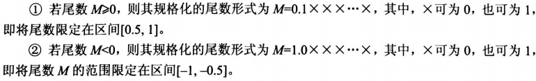

#### (7) 工业标准IEEE754
IEEE754是由IEEE制定的有关浮点数的工业标准。标准的表示形式如下：
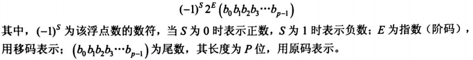

计算器中主要使用3中形式的IEEE754浮点数：
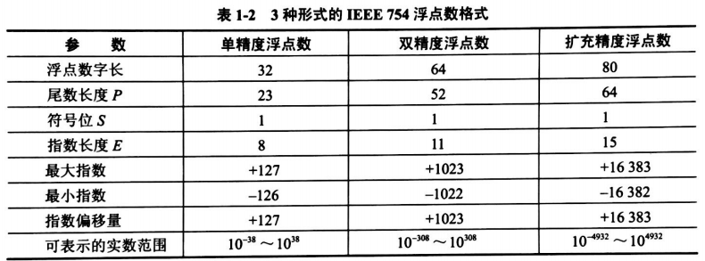

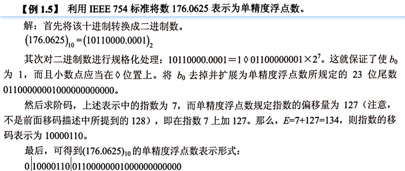

### 1-1-4 校验码
为了提高硬件电路的可靠性和代码的校验能力，使用校验码来检测传送的数据是否出错。
- 合法编码：用于传送数据。
- 错误编码：数据传送过程中出现某种错误时会变成错误编码，即可检测接收到的数据是否有错。

#### (1) 奇偶校验码

#### (2) 海明码
在数据位之间特定的位置上插入k个校验位，通过扩大码距来实现检错和纠错。

#### (3) 循环冗余校验码

## 1-2 计算机体系结构
### 1-2-1 计算机体系结构的发展
略

### 1-2-2 存储系统
#### (1) 存储器的层次结构
按存储器所处的位置分类：
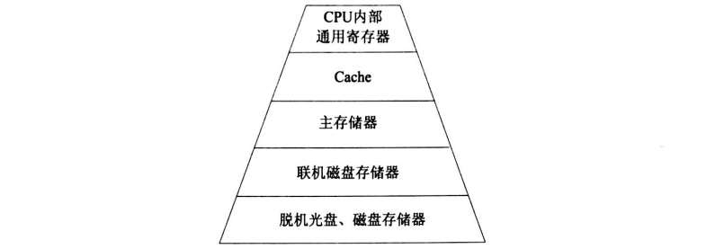
其中，cache和主存之间的交互功能全部由硬件实现，而主存与辐存之间的交互功能可由硬件和软件结合起来实现。
- 内存：主存，在主机内或主机板上；向CPU提供信息；容量小、速度快。
- 外存：辅存，磁盘、磁带和光盘等；存放不参与运行的大量信息；在需要时调入内存。

#### (2) 存储器的分类
按存储器的构成材料分类：
- 磁存储器：磁介质做成。
- 半导体存储器：按元件分为双极性和MOS型；按数据是否需要刷新分静态和动态两类。
- 光存储器：光学方法读写。

按存储器的工作方式分类：
- 读/写存储器（Random Access Memory，RAM）：能读取数据也能存入数据。
- 只读存储器。工作过程中仅能读取的存储器；根据数据的写入方式，可分为ROM、PROM、EPROM和EEPROM...
    - 固定只读存储器（Read Only Memory，ROM）：只读，一般用于存放系统程序BIOS和用于微程序控制。
    - 可编程的只读存储器（Programmable Read Only Memory，PROM）：可以一次性写入内容，写入后不能修改。
    - 可擦除可编程的只读存储器（Erasable Programmable Read Only Memory，EPROM）：可读可写可修改；紫外线擦除。
    - 电擦除可编程的只读存储器（Electrically Erasable Programmable Read Only Memory，EPROM）：可读可写可修改；电擦除。
    - 闪速存储器（Flash Memory）。闪存，类似于EEPROM。

按访问方式分类：
- 按地址访问的存储器
- 按内容访问的存储器

按寻址方式分类：
- 随机存储器（Random Access Memory，RAM）：可对任何存储单元存入或读取数据，访问任何一个存储单元所需时间相同。
- 顺序存储器（Sequentially Addressed Memory，SAM）：访问数据所需时间与数据所在的存储位置相关，如磁带。
- 直接存储器（Direct Addressed Memory，DAM）：介于RAM和SAM；对磁道寻址是随机的，而对磁道内是顺序寻址的。

#### (3) 相联存储器
按内容访问得存储器。
工作原理：把数据或数据的某一部分作为关键字，按顺序写入信息，读出时并行地将该关键字与存储器中的每一单元进行比较，找出存储器中所有与关键字相同的数据字；适合于信息的检索和更新。

#### (4) 高速缓存
用来存放当前最活跃的程序和数据。
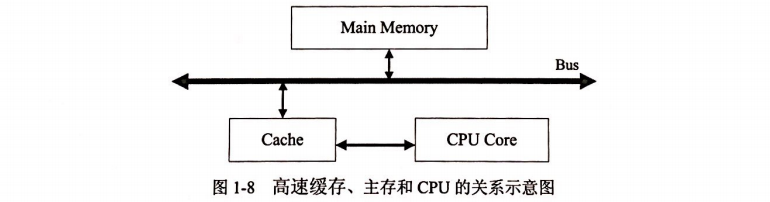

#### (5) 虚拟存储
对物理存储设备进行逻辑化的处理。

#### (6) 外存储器
用来存放暂时不用的程序和数据，以文件的形式存储。只有将其以文件为单位调入主存，CPU才可访问。
- 磁表面存储器：
- 光盘存储器：
- 固态硬盘：

#### (7) 磁盘阵列技术
磁盘阵列：由多个磁盘存储器组成的一个快速、大容量、高可靠的外村子系统。
廉价冗余磁盘阵列（Redundant Array of Independent Disk，RAID）

#### (8) 存储域网络
存储域网络（SAN）实现了是连接服务器和存储设备的网络，能将多个分布在不同地点的RAID组织成一个逻辑存储设备，供多个服务器共享访问。

存储设备可以是RAID、磁带备份系统、磁带库和CD-ROM库等构成。
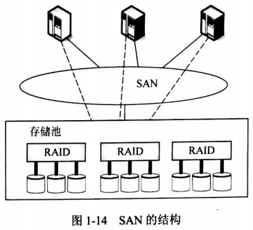

### 1-2-3 出入/输出技术
#### (1) 直接程序控制
是指外设数据的输入/输出过程是在CPU执行程序的控制下完成的。
- 无条件传送：外设总是准备好，可无条件随时接收/发送。
- 程序查询方式：CPU执行程序来查询外设是否准备好接收数据和输出数据。

#### (2) 中断方式
为减少CPU等待，当I/O系统准备好之后，则发出中断请求信号通知CPU，CPU接到中断请求信号后，保存正在执行程序的现场，
转入I/O中断服务程序的执行，完成与I/O系统的数据交换，然后再返回被打断的程序继续执行。
- 中断处理方法
    - 多中断信号线法
    - 中断软件查询法
    - 菊花链法
    - 总线仲裁法
    - 中断向量表法
- 中断优先级控制：一直给中断程序去给优先级更高的中断源服务（中断嵌套）
 
#### (3) 直接存储器存取方式
直接内存存取（Direct Memory Access，DMA）即在内存与I/O设备间传送一个数据块的过程中，不需要CPU的任何干涉。

#### (4) 输入/输出处理机
输入/输出处理机（Input/Output Processor，IOP）

### 1-2-4 总线结构
总线：计算机设备和设备之间传输信息的公共数据通道。

#### (1) 总线的分类
- 数据总线：传送数据信息，双向。
- 地址总线：传送CPU发出的地址信息，单向。
- 控制总线：传送控制信号、时序信号和状态信息

## 1-3 安全性、可靠性与系统性能评测基础知识
### 1-3-1 计算机安全概述

### 1-3-2 加密技术和认证技术
#### (1) 加密技术
- 对称加密（私人密钥加密）：文件加密和解密使用相同的密钥。
    - 数据加密标准算法（DES）：采用替换和移位的方法加密；用56位密钥对64位二进制数据库进行加密。
    - 三重DES：用两个56位密钥k1和k2，发送方用k1加密，k2解密，再使用k1加密；接收方反之。
    - RC-5：
    - 国际数据加密算法（IDEA）：
    - 高级加密标准算法（AES）：基于排列和置换运算；
- 非对称加密（公开密钥加密）：公钥和私钥是一对的，用公钥加密只能用对应的私钥才能解密。
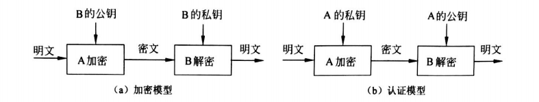

- 密钥管理
    - 密钥产生
    - 密钥备份和恢复
    - 密钥更新
    - 多密钥的管理
    

#### (2) 认证技术
认证技术：解决网络通信过程中通信双方的身份认可。

PKI：利用公钥理论和技术建立的提供安全服务的基础设施。
- 认证机构（CA）：数字证书的申请及签发机关。
- 数字证书库：存储已签发的数字证书及公钥，用户可由此获得所需的其他用户的证书及公钥。
- 密钥备份及恢复系统：密钥备份与恢复只能针对解密密钥，签名私钥为确保其唯一性而不能够作备份。
- 证书作废系统：证书在有效期在有效期内也可能作废，原因可能是密钥介质或用户身份变更等。
- 应用接口：应用接口系统

1）Hash函数与信息摘要（Message Digest）
MD5特点：
- 压缩性：长度固定
- 容易计算
- 抗修改性
- 强抗碰撞

2）数字签字

3）SSL协议
SSL（Secure Sockets Layer，安全嵌套层）协议，一个保证任何安装了安全套接字的客户和服务器间事务安全的协议。
- 用户和服务器的合法性认证
- 加密数据以隐藏被传送的数据
- 保护数据的完整性

对通信过程进行安全保护，经过如下几个阶段：
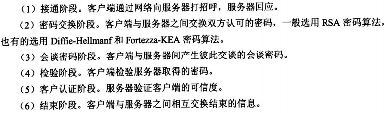

4）数字时间戳技术

