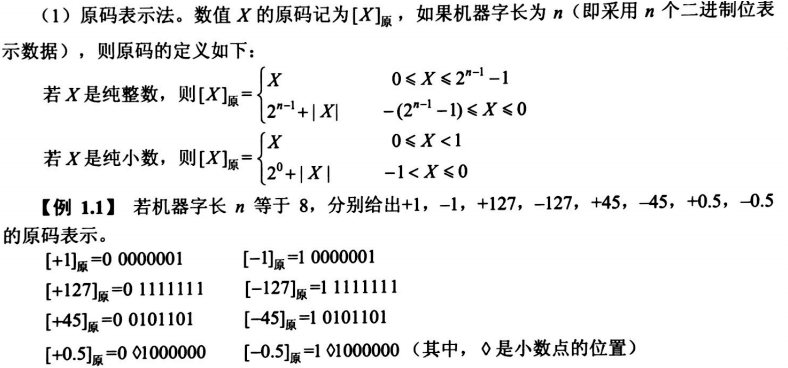

软件设计师教程(第5版)笔记
=====
基于`《软件设计师教程》`（`第五版`，`褚华 霍秋艳`主编，清华大学出版社）。

## 目录
* [1.计算机网络概论](#1.计算机网络概论)
    * [1.1.计算机系统基础知识](#1.1.计算机系统基础知识)
        * [1.1.1.计算机系统硬件基本组成](#1.1.1.计算机系统硬件基本组成)
        * [1.1.2.中央处理单元](#1.1.2.中央处理单元)
            * [1.1.2.1.CPU的功能](#1.1.2.1.CPU的功能)
            * [1.1.2.2.CPU的组成](#1.1.2.2.CPU的组成)
            * [1.1.2.3.多核CPU](#1.1.2.3.多核CPU)
        * [1.1.3.数据表示](#1.1.3.数据表示)
            * [1.1.3.1.原码表示法](#1.1.3.1.原码表示法)
            * [1.1.3.2.反码表示法](#1.1.3.2.反码表示法)
            * [1.1.3.3.补码表示法](#1.1.3.3.补码表示法)
            * [1.1.3.4.移码表示法](#1.1.3.4.移码表示法)
            

 
# 1.计算机网络概论

## 1.1.计算机系统基础知识

### 1.1.1.计算机系统硬件基本组成
- 计算机系统=硬件+软件
- 基本硬件系统：运算器、控制器、存储器、输入设备和输出设备。
- 中央处理单元（CPU）：运算器、控制器等部件集成到一起。CPU是硬件系统的核心，用于数据的加工处理，完成算术逻辑运算及控制功能。
- 存储器：记忆设备，分内部和外部存储器，前者速度高、容量小，临时；后者容量大、速度慢，可以长期保存程序和数据。
- 外部设备（外设）：输入设备+输出设备。

### 1.1.2.中央处理单元
#### 1.1.2.1.CPU的功能
- 程序控制：通过执行指令来控制程序。
- 操作控制：产生每条指令的操作信号，并将信号送往对应的部件，控制相应的部件。
- 时间控制：对指令执行过程钟操作信号的出现时间、持续时间及出现的时间顺序进行控制。
- 数据处理：对数据进行算术和逻辑等方式的运算（最根本任务）。
- 对系统内部和外部的中断（异常）做出相应。

#### 1.1.2.2.CPU的组成
主要由运算器、控制器、寄存器组和内部总线等部件组成。

运算器：
1. 算术逻辑单元（ALU）：对数据进行算术运算和逻辑运算。
2. 累加寄存器（AC）：是一个通用寄存器，为ALU提供一个工作区。
3. 数据缓冲寄存器（DR）：是CPU和内存、外部设备之间数据传送的中转站（缓冲）；在单累加器结构的运算器中，可兼作为操作数寄存器。
4. 状态条件寄存器（PSW）：PSW保存由算术和逻辑运算的结果建立的各种条件码内容；主要分状态标志、控制标志。

控制器：保证程序正确执行，处理异常事件。
1. 指令寄存器（IR）：CPU执行一条指令时，先把它从内存储器取到缓冲寄存器中，再送入IR暂存；
2. 程序计数器（PC）：具有寄存信息和计数两种功能，又称指令计数器。
3. 地址寄存器（AR）：保存当前CPU所访问的内存单元的地址。
4. 指令译码器（ID）：指令包含操作码和地址码；ID对指令的操作码进行解释。

总线：控制各种中断请求，按优先级高低对中断请求进行排队，逐个交给CPU处理。

寄存器组： 
专用寄存器、通用寄存器。运算器和控制器中的寄存器是专用寄存器；通用寄存器用途广泛可由程序员规定其用途。

#### 1.1.2.3.多核CPU
多任务处理。

### 1.1.3.数据表示
#### 1.1.3.1.原码表示法

在原码表示法中，最高位是符号为，0表示正好，1表示负号，其余n-1位表示数值的绝对值。数值0的原码有两种形式：[+0]原=0 0000000，[-0]原=1 0000000。

#### 1.1.3.2.反码表示法

在反码表示中，最高位是符号位，0表示正好，1表示负号，正数的反码与原码相同，负数的反码则是其绝对值按位求反。数值0的反码表示有两种形式：[+0]反=0 0000000，[-0]反=1 1111111。

#### 1.1.3.3.补码表示法

在补码表示法中，最高位为符号位，0表示正好，1表示负号，正数的补码与其原码和反码相同，负数的补码则等于反码的末尾加1。数值0的补码只有唯一一种形式：[+0]补=0 0000000，[-0]补=0 0000000。

#### 1.1.3.4.移码表示法

实际上，在偏移2n-1的情况下，只要将`补码`的符号位取反便可获得相应的移码的表示。

